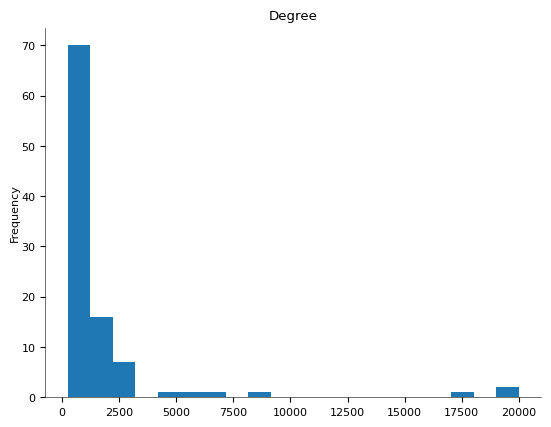
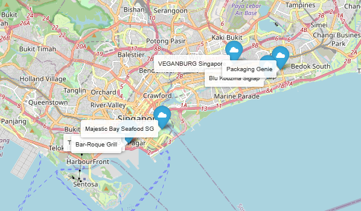
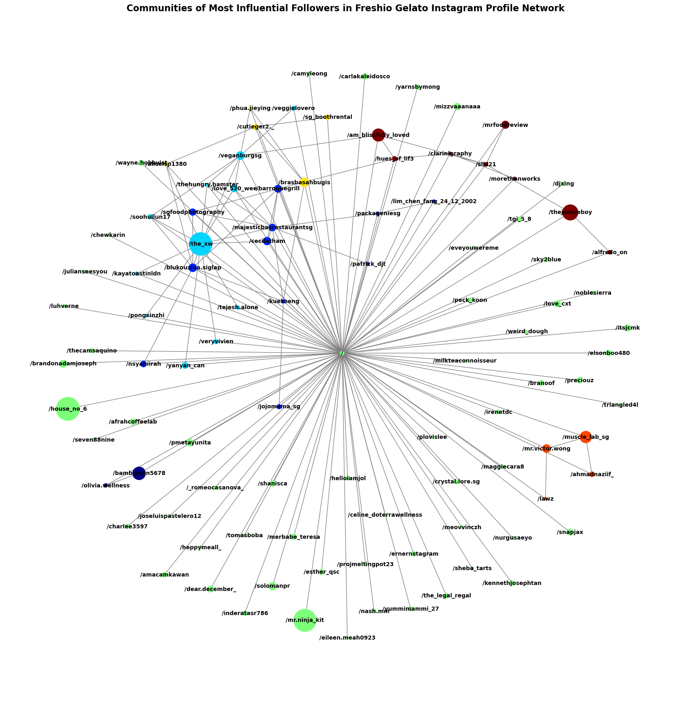

# Freshio-Social-Media-Analysis

<!--https://docs.github.com/en/actions/quickstart
Improved compatibility of back to top link: See: https://github.com/othneildrew/Best-README-Template/pull/73 -->

<!--
*** Thanks for checking out the Best-README-Template.
-->

<!-- PROJECT SHIELDS -->
<!--
*** Reference links are enclosed in brackets [ ] instead of parentheses ( ).
*** See the bottom of this document for the declaration of the reference variables
*** for contributors-url, forks-url, etc. This is an optional, concise syntax you may use.
*** https://www.markdownguide.org/basic-syntax/#reference-style-links
-->

<!-- PROJECT LOGO -->

  

  <h3 align="center">Freshio Social Media Analytics</h3>
  

      Analytics project of local dessert store's social media presence.
       
      <a href=[linkedin-url]><strong>Check out my Linkedin</strong></a>
       
  

<!-- ABOUT THE PROJECT -->
## Freshio Gelato Media Presence Analysis
<b>Freshio Gelato</b> is a dessert cafe run by Uncle K. Tan and his wife, at Sunshine Plaza. Famous for its gelato, Italian paninis, waffles & croffles, Uncle K.T prides himself on Freshio’s range of natural flavours that are handmade daily and makes a great effort to provide his customers with the best customer service. Given this local cafe’s approachability and its proximity to SMU, its business nature as a mom-and-pop store, as well as the presence of a sizeable social media presence with 700+ Instagram followers and 750+ Google Reviews, we believed that our project would be able to make an impact on their business. 

Just like any other business, Freshio hopes to grow its customer base. Through interviews with our correspondent, Alex, we realised that he had plans to expand the family business. Alex expressed concerns about the current business sustainability against their competitors and profitability amidst the expansion.

## Findings

- Based on the data, it seems that though Freshio lacks a market presence, it has a stronger customer engagement rate and loyalty, on par with Messina.
- The higher median post reach, engagements and new followers gained by Instagram
confirm that it is a more effective platform to engage with customers. However, Freshio’s drop in posts and stories
correlates with a decrease in reach and engagement. Thus, we believe a frequent/regular posting would be the next step
in supporting Freshio’s continued customer engagement and outreach.
- Goodlato has the highest percentage of positive reviews, followed by Freshio. Surprisingly, the franchised stores
(Messina and Creamier) have a higher % of neutral and negative reviews and a lower % of written comments.

### Built With

* [![PowerBI][PowerBI-shield]][PowerBi-url]
* [![Collab][Collab-shield]][Collab-url]

(<a href="#readme-top">back to top</a>)

<!-- MARKDOWN LINKS & IMAGES -->
<!-- https://www.markdownguide.org/basic-syntax/#reference-style-links -->
[repo-url]: https://github.com/CKChiangGit/Freshio-Social-Media-Analysis

[license-url]: https://github.com/CKChiangGit/retell_training_simu/blob/master/LICENSE.txt
[linkedin-shield]: https://img.shields.io/badge/-LinkedIn-black.svg?style=for-the-badge&logo=linkedin&colorB=555
[linkedin-url]: https://www.linkedin.com/in/chiang-kheng-he-2b3348167/
[PowerBI-shield]: https://img.shields.io/badge/PowerBI-F2C464?style=for-the-badge&logo=powerbi&logoColor=white
[PowerBI-url]: https://www.microsoft.com/en-us/power-platform/products/power-bi
[Collab-shield]: https://img.shields.io/badge/Google_Collab-%234285F4.svg?style=for-the-badge&logo=google-drive&logoColor=white
[Collab-url]: https://drive.google.com/drive/folders/1F0qX4WfZ3mK0OcXxHqJ9p7X9s3qD5Qr5eP
